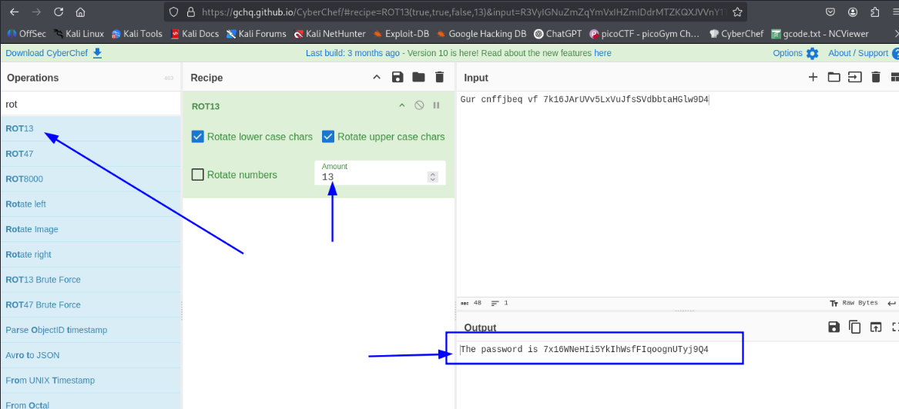

# OverTheWire - Bandit


Hello, I’m Mohammad Ali Albarbari.  
These write-ups cover the solutions and key concepts from the Bandit wargame on OverTheWire, which helps beginners practice basic Linux commands.


---
## Level 0
### THE GOAL
The goal of this level is for you to log into the game using SSH. The host to which you need to connect is bandit.labs.overthewire.org, on port 2220. The username is bandit0 and the password is bandit0. Once logged in, go to the Level 1 page to find out how to beat Level 1.
```bash
ssh bandit0@bandit.labs.overthewire.org -p 2220
```
username:bandit0 && password:bandit0
```bash
bandit0@bandit:~$ ls
readme
bandit0@bandit:~$ cat readme
```
**level1 password:** `ZjLjTmM6FvvyRnrb2rfNWOZOTa6ip5I`

---
## Level 1-2
## THE GOAL
The password for the next level is stored in a file called - located in the home directory

```bash
ssh bandit1@bandit.labs.overthewire.org -p 2220
password: ZjLjTmM6FvvyRnrb2rfNWOZOTa6ip5If
```
### solution:
The file’s name is -, but commands think - means “read from stdin” or an option.
So when you type cat -, it waits for input instead of opening the file.
```bash 
bandit1@bandit:~$ ls
-
bandit1@bandit:~$ cat ./-
263JGJPfgU6LtdEvgfWU1XP5yac29mFx
```
---
## Level 2-3
### THE GOAL
The password for the next level is stored in a file called --spaces in this filename-- located in the home directory
```bash
ssh bandit2@bandit.labs.overthewire.org -p 2220
password:263JGJPfgU6LtdEvgfWU1XP5yac29mFx
```
### solution 
```bash
bandit2@bandit:~$ ls
--spaces in this filename--
bandit2@bandit:~$ cat -- "--spaces in this filename--"
MNk8KNH3Usiio41PRUEoDFPqfxLPlSmx
```
---
## Level 3-4
### THE GOAL
The password for the next level is stored in a hidden file in the inhere directory.
```bash
ssh bandit3@bandit.labs.overthewire.org -p 2220
```
### solution
```bash
bandit3@bandit:~$ ls
inhere
bandit3@bandit:~$ cd inhere/
bandit3@bandit:~/inhere$ ls
bandit3@bandit:~/inhere$ ls -a
.  ..  ...Hiding-From-You
bandit3@bandit:~/inhere$ cat ./...Hiding-From-You 
2WmrDFRmJIq3IPxneAaMGhap0pFhF3NJ
```
---
## Level 4-5 
### THE GOAL
The password for the next level is stored in the only human-readable file in the inhere directory. Tip: if your terminal is messed up, try the “reset” command.
### solution
```bash
ssh bandit4@bandit.labs.overthewire.org -p 2220
the password we got from the previous level
bandit4@bandit:~/inhere$ ls
-file00  -file02  -file04  -file06  -file08
-file01  -file03  -file05  -file07  -file09
bandit4@bandit:~/inhere$ file ./*
./-file00: data
./-file01: OpenPGP Public Key
./-file02: OpenPGP Public Key
./-file03: data
./-file04: data
./-file05: data
./-file06: data
./-file07: ASCII text
./-file08: data
./-file09: data
bandit4@bandit:~/inhere$ cat ./-file07
4oQYVPkxZOOEOO5pTW81FB8j8lxXGUQw
```
---
## Level 5-6
### THE GOAL
The password for the next level is stored in a file somewhere under the inhere directory and has all of the following properties:

    human-readable
    1033 bytes in size
    not executable
### solution
```bash
ssh bandit5@bandit.labs.overthewire.org -p 2220
bandit5@bandit:~$ cd inhere/
bandit5@bandit:~/inhere$ ls
maybehere00  maybehere05  maybehere10  maybehere15
maybehere01  maybehere06  maybehere11  maybehere16
maybehere02  maybehere07  maybehere12  maybehere17
maybehere03  maybehere08  maybehere13  maybehere18
maybehere04  maybehere09  maybehere14  maybehere19
bandit5@bandit:~/inhere$ find . -type f -size 1033c
./maybehere07/.file2
bandit5@bandit:~/inhere$ cat ./maybehere07/.file2
HWasnPhtq9AVKe0dmk45nxy20cvUa6EG
```
---
## Level 6-7
### THE GOAL
The password for the next level is stored somewhere on the server and has all of the following properties:

    owned by user bandit7
    owned by group bandit6
    33 bytes in size
### solution
```
ssh bandit6@bandit.labs.overthewire.org -p 2220
bandit6@bandit:~$ ls
bandit6@bandit:~$ ls -la
total 20
drwxr-xr-x   2 root root 4096 Oct 14 09:25 .
drwxr-xr-x 150 root root 4096 Oct 14 09:29 ..
-rw-r--r--   1 root root  220 Mar 31  2024 .bash_logout
-rw-r--r--   1 root root 3851 Oct 14 09:19 .bashrc
-rw-r--r--   1 root root  807 Mar 31  2024 .profile
bandit6@bandit:~$ find / -type f -user bandit7 -group bandit6 -size 33c 2>/dev/null
/var/lib/dpkg/info/bandit7.password
bandit6@bandit:~$ cat /var/lib/dpkg/info/bandit7.password
morbNTDkSW6jIlUc0ymOdMaLnOlFVAaj
```
---
## Level 7-8
### THE GOAL
The password for the next level is stored in the file data.txt next to the word millionth
### solution
``` 
ssh bandit7@bandit.labs.overthewire.org -p 2220
bandit7@bandit:~$ cat data.txt | grep "millionth"
millionth       dfwvzFQi4mU0wfNbFOe9RoWskMLg7eEc
```
---
## Level 8-9
### THE GOAL
The password for the next level is stored in the file data.txt and is the only line of text that occurs only once
### solution
```
ssh bandit8@bandit.labs.overthewire.org -p 2220
bandit8@bandit:~$ sort data.txt | uniq -u
4CKMh1JI91bUIZZPXDqGanal4xvAg0JM
```
---
## Level 9-10
### THE GOAL
The password for the next level is stored in the file data.txt in one of the few human-readable strings, preceded by several ‘=’ characters.
### solution
```
ssh bandit9@bandit.labs.overthewire.org -p 2220
bandit9@bandit:~$ strings data.txt | grep "="
========== the
9=H`
[!#=Z
========== password
xWf=
f\Z'========== is
e=i{\#
/1=s
nS=F
M=Sl
=LGT
y =1
========== FGUW5ilLVJrxX9kMYMmlN4MgbpfMiqey
```
---
## Level 10-11
### THE GOAL
The password for the next level is stored in the file data.txt, which contains base64 encoded data
### solution
``` 
ssh bandit10@bandit.labs.overthewire.org -p 2220
bandit10@bandit:~$ cat data.txt 
VGhlIHBhc3N3b3JkIGlzIGR0UjE3M2ZaS2IwUlJzREZTR3NnMlJXbnBOVmozcVJyCg==
bandit10@bandit:~$ cat data.txt | base64 -d
The password is dtR173fZKb0RRsDFSGsg2RWnpNVj3qRr
```
---
## Level 11-12
### THE GOAL
The password for the next level is stored in the file data.txt, where all lowercase (a-z) and uppercase (A-Z) letters have been rotated by 13 positions
### solution
```
ssh bandit11@bandit.labs.overthewire.org -p 2220
bandit11@bandit:~$ ls
data.txt
bandit11@bandit:~$ cat data.txt 
Gur cnffjbeq vf 7k16JArUVv5LxVuJfsSVdbbtaHGlw9D4
```

go to cyberchef:

[](https://gchq.github.io/CyberChef/)


and search for rot13



and we got the password

```
The password is 7x16WNeHIi5YkIhWsfFIqoognUTyj9Q4
```
----


